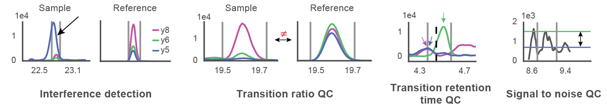

# madic: MAtrix-Dependent Interference Correction for targeted mass spectrometry data
madic is a Python package for detecting and correcting interference in targeted mass spectrometry data using high-performance Pandas data structures.

[](https://travis-ci.org/dcroote/madic)
[-blue.svg)](https://github.com/dcroote/madic/blob/master/LICENSE)

## Purpose
Multiple reaction monitoring (MRM, also known as selected reaction monitoring / SRM) data acquired during targeted mass spectrometry experiments can suffer from complex interference patterns that hinder accurate quantification. This software identifies and corrects interference, as well increases the confidence of peptide calls according to three qualities of an ideal chromatogram: relative transition ratios similar to synthetic standards, co-elution of all individual target transitions with respective stable isotope labeled (SIL) transitions, and a distinguished peak relative to the background. Additionally, these criteria should be satisfied for all replicate injections of a given sample.

See the [Jupyter Notebook tutorial](examples/tutorial.ipynb) for a visual walk-through of interference correction in action.
<p align="center">

</p>

## Installation

madic depends on a functioning Python 2.7 or 3.4+ installation (I recommend [installing Anaconda](https://conda.io/docs/user-guide/install/index.html), which works on Windows, Linux, and macOS) and the following python packages: [scipy](https://scipy.org/), [numpy](http://www.numpy.org/), [pandas](https://pandas.pydata.org/), and [matplotlib](https://matplotlib.org/).

Installing the current release using the `pip` python package manager:

```bash
pip install madic
```

Installing the development version (requires git):

```bash
pip install git+https://github.com/dcroote/madic.git#egg=madic
```

## Usage

This tool is capable of processing SRM / MRM data from any instrument vendor so long as the raw data is capable of being loaded into [Skyline-daily](https://skyline.ms/project/home/software/Skyline/daily/begin.view?) (version 3.7.1.11357 or greater). This is a requirement because of the recently added ability to export chromatogram data within reports. You can check the program version by going to Help --> About. 

It is strongly preferred that injections contain stable isotope (also known as "heavy") labeled versions of all measured peptides. In the absence of these heavy peptides madic will fail to evaluate transition retention time variability and overall levels of confidence in the results may be somewhat compromised.

1. **Data preparation** (< 10 minutes)

    1. You will need to download the following Skyline-daily report file to export data from Skyline-daily with the correct formatting:
        + [madic_skyline_daily_transition_report_and_chromatogram.skyr](https://raw.githubusercontent.com/dcroote/madic/master/static/madic_skyline_daily_transition_report_and_chromatogram.skyr)

    2. Load the report file into Skyline-daily using the following steps:
        + File --> Export --> Report --> Edit list --> Import

    3. Two reports need to be exported:
        1. Sample data - this report should originate from a Skyline-daily document that contains samples to be analyzed
        2. Reference data - this report should originate from a Skyline-daily document that contains only standards or QC samples that provide reference transition ratios.

2. **Program execution**

    MADIC can be used as a standalone python executable or be imported into an interactive jupyter notebook for visualization (see *Tutorial* section below).

    Command line usage:

    ```python
    madic.py [options] csv ref_csv delimiter delimiter_pos
    ```
    
    `delimiter` and `delimiter_pos` are necessary to identify samples from within replicate injection names. For example, `_` (an underscore) for the `delimiter` and `1` for the `delimiter_pos` would correctly identify the two samples (sampleA and sampleB) within the following injection names:

        Study1_sampleA_injection1
        Study1_sampleA_injection2
        Study1_sampleB_injection1
        Study1_sampleB_injection2

    (Remember Python uses zero-based indexing, so after splitting each replicate name into an array of three elements using the underscore, the second element is referred to as `delimiter_pos` 1.)

## Tutorial

See the [Jupyter Notebook tutorial](examples/tutorial.ipynb) for a visual walk-through of interference correction

## Testing

Utilizes `pytest`. To test madic, run `python setup.py test` in the source directory.

## Development

Please submit issues to the [issue tracker](https://github.com/dcroote/madic/issues).

Pull requests welcome!
